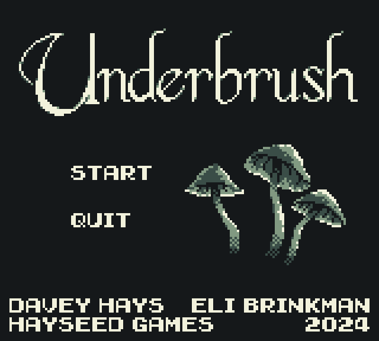
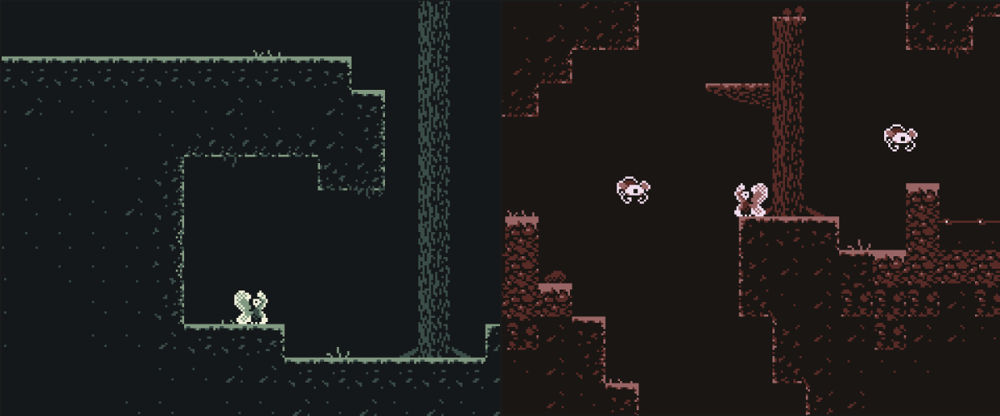

# 🌿 Underbrush

> A pixel art platformer built in under a week during an Atlas hack sprint. Explore (and escape) a toxic, exploited forest as a tiny fairy and discover hidden secrets.

## 👤 About the Developer

Hi, I'm Elias Brinkman, a creative developer and visual designer with a passion for storytelling through interaction. I love combining visual art with coding to create small but polished game experiences like *Underbrush*.

- 🔗 [Portfolio](https://ezb.xyz)
- 💼 [LinkedIn](https://www.linkedin.com/in/elias-brinkman/)

## 🎮 About the Game

**Underbrush** is a lovingly crafted 2D platformer created in just under a week using the [Godot Engine](https://godotengine.org/) for Atlas’ second trimester hack sprint.

We set out to make a *small* game that felt *complete* and *polished*. With the theme revealed as _"fairytales"_, our concept quickly took root: a FernGully-inspired tale of a fairy navigating a forest twisted by human exploitation.

What started as “platformers are easy to make” quickly turned into a deep dive into unfamiliar tools, creative visual solutions, and fast-paced decision making.

## 🧪 Try It Out

[👉 Play Underbrush on Itch.io](https://paddingtonrex.itch.io/underbrush)

## ✨ Features

- 🎨 Hand-crafted pixel art tilesets and animations
- 🎼 Original music and sound effects
- 🧩 Three increasingly challenging levels
- 🌈 Unique palettes per level using dynamic recoloring shaders
- 🎁 Secret collectibles and power-ups
- 🐞 Enemies with simple but fun behavior patterns
- 🖥️ Fully playable in-browser via Itch.io

## 👩‍💻 Development Highlights

- **Engine**: [Godot](https://godotengine.org/) using GDScript
- **Art**: [Aseprite](https://www.aseprite.org/)
- **Audio**: [Bosca Ceoil](https://yurisizov.itch.io/boscaceoil-blue) and [JSFXR](https://sfxr.me/)
- **Team Management**: [Trello](https://trello.com/) for MVP → stretch goals planning

We split our time between learning the software and designing the game. I created all visual elements, tilemaps, and UI assets, while also co-developing core game mechanics, implementing shader logic for palette swapping, and designing levels.

One of my favorite challenges was figuring out how to dynamically recolor assets. After early failures swapping texture sources, I implemented custom shaders to tint sprites based on palette variables — allowing the same tilemap to be reused across levels with distinct moods.

## 🎯 Stretch Goals Completed

- ✅ Custom palette shader system
- ✅ Secret areas and power-ups
- ✅ Start and end screens with music
- ✅ Modular scene system for assets

## 🧱 In Progress / Future Plans

- 🔲 Add controller support
- 🔲 Improve screen resolution handling on web platforms
- 🔲 Create fourth level with new enemy types
- 🔲 Refactor game start screen to scale cleanly across aspect ratios

## 🧠 Challenges and Learnings

Our biggest hurdle came at the end — realizing that our start screen, built from a static image, stretched awkwardly at different aspect ratios on Itch.io. It’s something I’m eager to fix, and a great lesson in building UIs that scale properly.

We also worked through learning an entirely new engine, language, and toolset from scratch. Within that week, I learned how shaders could be used not just for visual flair but as problem-solving tools — a technique I’ll definitely bring into future projects.

## 👥 Credits

- Developed by **[Elias Brinkman](https://github.com/eliBrank)** and [**Davey Hays**](https://github.com/DaveyCHaysIII/)  
- Sound & Music: Davey Hays  
- Visuals, UI & Art Direction: Elias Brinkman  
- Level Design and Programming: Shared
